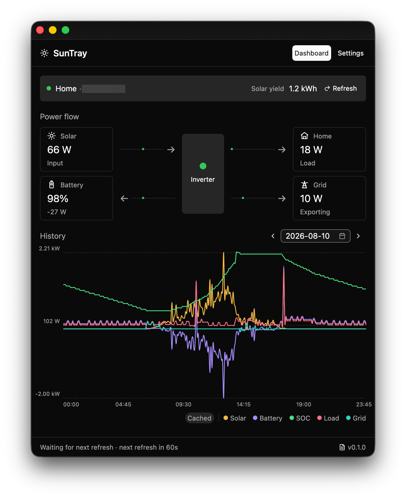

# sunsynktray

[](https://github.com/leonjza/sunsynktray/actions/workflows/api-smoke.yml)

SunSynk Tray Applications for Inverter Monitoring using the SunSynk Cloud Service.



## Features

- Monitor live solar generation, household load, grid exchange, battery power,
  and battery state of charge from the SunSynk cloud service.
- View the current power flow and daily historical charts, with date navigation
  and chart hover details.
- Discover and switch between the inverters associated with a SunSynk account.
- Keep using the last known snapshot while a connection is unavailable; live
  data and historical responses are cached locally in SQLite.
- Gradually backfill historical data in the background. The backfill range can
  be configured from 1 to 3,650 days and paused or resumed from Settings.
- Show battery SoC, solar output, or load in the system tray, or leave the tray
  metric disabled. macOS uses native menu-bar text and Windows uses a DPI-aware
  icon.
- Store account credentials and refresh tokens in the operating system keychain
  through the `keyring` crate.
- Launch at sign-in on macOS and Windows, with normal launches opening the
  dashboard and startup launches remaining in the tray.
- Inspect recent API requests in the in-app connection log.

## Requirements

Rust stable is required to build from source. A graphical desktop session is
required at runtime. The release workflow currently packages macOS arm64 and
Windows x64 builds; Linux support is provided by the underlying tray backend but
is not packaged by this repository.

## Run from source

Clone the repository and start the application with:

```sh
cargo run --release
```

On first launch, open Settings, enter the email address and password for your
SunSynk account, choose an inverter, and click **Connect account**. The refresh
interval defaults to 60 seconds and the historical range defaults to 365 days.

To start hidden in the system tray, pass the startup flag:

```sh
cargo run --release -- --startup
```

The `--inspect-api` option runs the API diagnostic client instead of starting
the UI. It writes a redacted API fixture containing the selected inverter’s
responses. Use `--serial=<serial>` to select an inverter and
`--output=<path>` to choose the fixture path. See
[`src/diagnostics.rs`](src/diagnostics.rs) for the complete implementation.

## Configuration

The API endpoint can be overridden for development or testing with
`SUNSYNK_API_URL`:

```sh
SUNSYNK_API_URL=https://api.sunsynk.net cargo run --release
```

The default endpoint is `https://api.sunsynk.net`. Account credentials are
entered in the UI and persisted in the platform keychain; they are not read
from a checked-in configuration file. Cached snapshots and historical points
are stored in `suntray.sqlite3` under the platform application-data directory.

## Packaging

Packaging is managed by [`cargo-packager`](https://docs.rs/cargo-packager/latest/cargo_packager/).
Install it once with:

```sh
cargo install cargo-packager --locked
```

Build a release package for the target platform with:

```sh
cargo build --locked --release --target <target-triple>
cargo packager --release --target <target-triple>
```

For macOS, use the repository script so the application bundle also receives
its `SunTrayStartup.app` login-item helper:

```sh
bash packaging/macos/package.sh aarch64-apple-darwin
```

The Windows release produces a current-user NSIS installer. The release
workflow also publishes a portable Windows ZIP. macOS releases are packaged as
an arm64 `.pkg` installer. Versions for release builds are synchronised across
`Cargo.toml`, `Cargo.lock`, and the macOS plist with:

```sh
bash packaging/set-version.sh 1.2.3
```

## API smoke test

The API smoke test exercises authentication, plant discovery, the live power
flow endpoint, and historical day-energy responses:

```sh
bash tests/api-smoke.sh
```

It requires `curl`, `jq`, `openssl`, and `base64`. Supply disposable test
credentials through the environment when needed:

```sh
SUNSYNK_USERNAME=you@example.com \
SUNSYNK_PASSWORD='your-password' \
SUNSYNK_BASE_URL=https://api.sunsynk.net \
bash tests/api-smoke.sh
```

The default base URL used by the script is `https://api.sunsynk.net`.

## Development checks

Run the Rust test suite with:

```sh
cargo test --locked
```


## Core dependency notes

SunTray was migrated to `gpui-kit` 0.6 and its matching `gpui-pre` platform
layer. The migration updated the application and component APIs, theme
initialisation, background timers, and chart configuration while preserving
system light/dark appearance.

`gpui-tray` is vendored in [`vendor/gpui-tray`](vendor/gpui-tray) and selected
through the workspace patch in `Cargo.toml`. The local version follows the
GPUI 0.6-era `gpui-pre` API and includes these platform changes:

- macOS supports native SF Symbols and native status-item titles, keeping
  numeric tray values sharp on Retina displays.
- Windows converts RGBA icons into native Windows icons with an alpha mask,
  allowing the tray to display readable, DPI-aware metric values.
- Tray menu actions remain regular GPUI actions, and tray resources are kept
  on the GPUI thread with explicit cleanup.

These dependency changes should be validated with both Windows and macOS
packaging builds.
